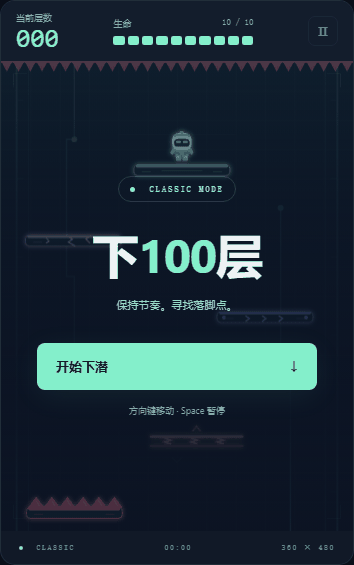
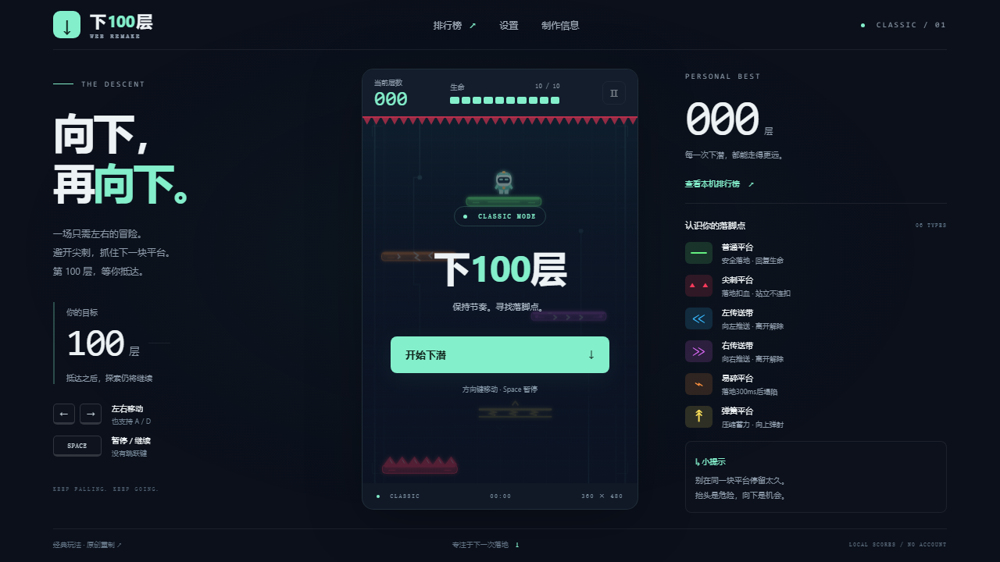

# 下100层 · Web重制版

经典下楼梯玩法，原创极简卡通微霓虹美术。纯浏览器运行，无账号、后端或收费API。

**[在线试玩](https://phanvanlong737-cyber.github.io/ns-shaft-web-remake/)** · [需求规格](docs/requirements.md) · [难度研究](docs/difficulty-research.md) · [测试报告](docs/test-report.md)



> 发布候选版。演示为自动键盘操作，不代表人工100层验收。正式v1.0等待人工0—100层及Android实机确认。

## 玩法

向下寻找平台，躲避尖刺。普通、假平台、左右传送带和弹簧落地回血，尖刺扣5HP；被带到顶部也会受伤。HP归零或完全掉出底部死亡。到达100层庆祝后继续无尽。

| 操作 | 键位 |
|---|---|
| 左右移动 | ← / → 或 A / D；同时按两方向归零 |
| 暂停 / 继续 | Space / Escape 或暂停按钮 |
| 手机 | 画面下方左右触控按钮 |
| 重开 / 返回 | 暂停与结算界面按钮 |

没有主动跳跃。切到后台自动暂停，返回需主动继续。层数取最深平台序号÷5向下取整。本机Top 10以层数排序，不保存进行中的一局。

根据实际4399 Flash文件修正了首轮偏低的难度：普通平台28%、尖刺19%。第二轮试玩反馈后，横移提高至170逻辑像素/秒，滚屏初速140，每5层增加14；100层为420。仍保留1秒受伤保护和基础可达性保底，不宣称全规则精确复刻。

## 本地运行

Node.js 24及npm，Windows/macOS/Linux均可开发。

```bash
npm ci
npm run dev
```

打开终端显示的本地地址。不能直接双击index.html运行ES模块。

```bash
npm test
npm run build
npm run preview
```

浏览器测试：

```bash
npx playwright install chromium firefox
npm run test:e2e
node tools/verify-build.mjs
```

Windows还会检测已安装Chrome/Edge；其他系统与CI运行Chromium、Firefox和Pixel 7模拟。Android实机不等于模拟测试。

## 结构与原创资源

`src/core`纯规则与固定步长；`src/data`存档/资源；`src/ui`页面/输入；`src/rendering`矢量画面、动画及音频。详细数据流见[架构说明](docs/architecture.md)。

所有SVG兼具源文件和运行时用途，可编辑；`node tools/generate-assets.mjs`重建9个原创资源。音频由Web Audio合成，没有外部采样。音乐与特效不会修改规则。美术规格见[art-guide](docs/art-guide.md)。



## 复现与答辩

- [Classic行为规范](docs/gameplay-spec.md)、[固定参考版本](docs/reference-analysis.md)
- [测试计划](docs/test-plan.md)、[实际结果](docs/test-report.md)、[发布审计](docs/release-audit-v1.0.md)
- [答辩说明](docs/defense-notes.md)、[版本记录](CHANGELOG.md)
- `node tools/qa-soak.mjs 600`执行10分钟真实浏览器长期测试，需开发服务器运行。
- 截图/GIF复现：`node tools/capture-demo.mjs`后运行`python tools/make-demo-gif.py`，Python需要Pillow；游戏本身不需要Python。

## 部署

GitHub Pages使用GitHub Actions发布。仓库Settings → Pages选择GitHub Actions。主分支通过规则测试、浏览器测试、构建和子路径烟测后上传dist并部署；PR只验证，不发布。

Vite默认相对base，适配仓库子路径；也可用VITE_BASE显式覆盖。工作流不写死用户名。部署仅使用静态文件，不发送成绩到服务器。

## 来源与许可

项目贡献者制作的独立代码、SVG与合成音频使用[MIT](LICENSE)。[iPel/NS-SHAFT](https://github.com/iPel/NS-SHAFT)为行为参考，Apache-2.0文本保留；没有复制其主程序或图片。4399提供的原SWF仅在被Git忽略的本地目录分析，不进入源码或dist。

完整说明见[THIRD_PARTY_NOTICES](docs/THIRD_PARTY_NOTICES.md)与[素材清单](docs/assets-license.csv)。本项目不是4399或NAGI-P官方作品。
